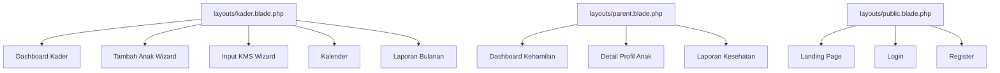
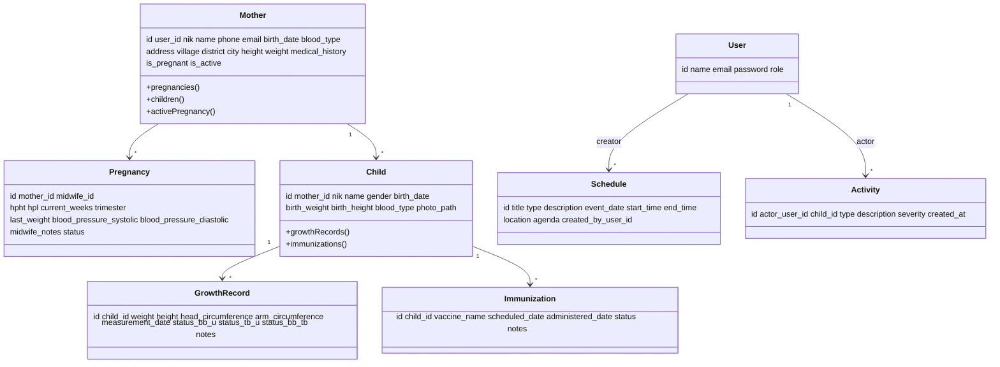
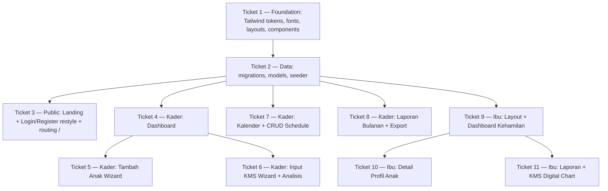

# Posyandu Vinca — Implementasi Desain UI dari Folder `9 mei`

> Spec ini adalah sumber kebenaran untuk seluruh pekerjaan implementasi UI/UX baru di proyek `posyandu-vinca`. Stack tetap: **Laravel 12 + Blade + Tailwind via Vite + Alpine.js + Chart.js**. Tidak ada framework JS baru. Semua keputusan kunci sudah dikonfirmasi dengan user.

---

## 1. Tujuan & Cakupan

Mengubah seluruh tampilan Posyandu Vinca agar sama persis dengan 9 mockup di folder `9 mei/`:

| Mockup | Halaman | Role |
|---|---|---|
| `landingpage.html` | Landing Page publik | Guest |
| `kader1.html` | Dashboard Kader | Kader |
| `kader2.html` | Tambah Data Anak (3‑step wizard) | Kader |
| `kader3.html` | Input KMS (3‑step + analisis Z‑Score) | Kader |
| `kader4.html` | Kalender Kegiatan | Kader |
| `kader5.html` | Laporan Bulanan Posyandu | Kader |
| `user1.html` | Dashboard Kehamilan (Parent Portal) | Ibu |
| `user2.html` | Detail Profil Anak (Parent Portal) | Ibu |
| `user3.html` | Laporan Kesehatan + KMS Digital | Ibu |
| (semua) | Re‑style Login & Register agar konsisten | Guest |

---

## 2. Keputusan Teknis

| Topik | Keputusan |
|---|---|
| Tailwind & Font | **Hybrid**: Vite untuk Tailwind + token Material 3 + Google Fonts (Inter & Atkinson Hyperlegible Next). **Material Symbols Outlined tetap pakai CDN Google Fonts** (`<link>` di setiap layout). |
| Database | Migration & model **baru sekarang** untuk fitur dinamis: perluas `mothers`, perluas `pregnancies`, lengkapi `schedules`, tambah `immunizations` & `activities`. |
| Routing `/` | Landing page publik untuk guest; **auto‑redirect ke `/dashboard` jika sudah login**. |
| Asset gambar | **Placeholder via inisial avatar / div solid color** (mis. UI Avatars CDN atau div Tailwind). Tidak pakai URL `lh3.googleusercontent.com`. |

---

## 3. Design System (Tailwind Tokens)

Akan ditanam ke `tailwind.config.js`.

### 3.1 Palette (Material 3 Light)

```
primary             #004ac6       on-primary             #ffffff
primary-container   #2563eb       on-primary-container   #eeefff
primary-fixed       #dbe1ff       primary-fixed-dim      #b4c5ff
on-primary-fixed    #00174b       on-primary-fixed-variant #003ea8

secondary             #006c49     on-secondary             #ffffff
secondary-container   #6cf8bb     on-secondary-container   #00714d
secondary-fixed       #6ffbbe     secondary-fixed-dim      #4edea3
on-secondary-fixed    #002113     on-secondary-fixed-variant #005236

tertiary             #943700      on-tertiary             #ffffff
tertiary-container   #bc4800      on-tertiary-container   #ffede6
tertiary-fixed       #ffdbcd      tertiary-fixed-dim      #ffb596

error             #ba1a1a         on-error             #ffffff
error-container   #ffdad6         on-error-container   #93000a

surface                       #faf8ff
surface-bright                #faf8ff
surface-container-lowest      #ffffff
surface-container-low         #f3f3fe
surface-container             #ededf9
surface-container-high        #e7e7f3
surface-container-highest     #e1e2ed
surface-variant               #e1e2ed
surface-dim                   #d9d9e5
on-surface                    #191b23
on-surface-variant            #434655
outline                       #737686
outline-variant               #c3c6d7
inverse-surface               #2e3039
inverse-on-surface            #f0f0fb
inverse-primary               #b4c5ff
background                    #faf8ff
on-background                 #191b23
```

### 3.2 Typography

| Token | Size/Line-height | Weight | Font |
|---|---|---|---|
| `display-lg` | 48/1.2 -0.02em | 700 | Atkinson Hyperlegible Next |
| `headline-lg` | 32/1.3 | 600 | Atkinson Hyperlegible Next |
| `headline-lg-mobile` | 24/1.3 | 600 | Atkinson Hyperlegible Next |
| `title-md` | 20/1.5 | 600 | Inter |
| `body-lg` | 18/1.6 | 400 | Inter |
| `body-md` | 16/1.6 | 400 | Inter |
| `label-sm` | 14/1.4 0.01em | 500 | Inter |
| `label-xs` | 12/1.2 | 600 | Inter |

### 3.3 Spacing & Radius

```
spacing: base 8, stack-sm 12, gutter 24, stack-md 24, margin-mobile 16,
         margin-desktop 40, stack-lg 48, container-max 1280
borderRadius: DEFAULT 0.25rem, lg 0.5rem, xl 0.75rem, full 9999px
```

### 3.4 Class Helpers

- `.soft-card` / `.tonal-elevation-1` → `box-shadow: 0px 4px 20px rgba(0,0,0,0.04)` + `border-radius: 1.5rem`
- `.hero-gradient` → `linear-gradient(135deg, #faf8ff 0%, #f3f3fe 100%)`
- `.material-symbols-outlined` → `font-variation-settings: 'FILL' 0, 'wght' 400, 'GRAD' 0, 'opsz' 24;`

### 3.5 Tata Letak Asset

- `tailwind.config.js` → extend tokens di atas
- `resources/css/app.css` → `@tailwind base/components/utilities` + helper classes + `@layer base { html { font-family: 'Inter'; } }`
- Material Symbols → `<link href="https://fonts.googleapis.com/css2?family=Material+Symbols+Outlined:wght,FILL@100..700,0..1&display=swap" rel="stylesheet">` di setiap layout
- Google Fonts (Inter + Atkinson) → `<link>` di setiap layout

---

## 4. Arsitektur Layout (Blade)

Dibuat **3 layout terpisah**, semuanya pakai font + Material Symbols + Tailwind yang sama:



### 4.1 `layouts/kader.blade.php`

- Sidebar kiri 256px (fixed) — brand **PosyanduKader** font Atkinson teal `text-secondary`, kartu profil kader (avatar inisial + nama + wilayah), nav (Dashboard, Data Anak, Input KMS, Kalender, Laporan), footer Logout merah
- Top bar sticky `bg-surface/80 backdrop-blur` dengan greeting dinamis (`Selamat Pagi/Siang/Sore, Ibu {name}`), ikon notifikasi (badge merah), settings, avatar
- Main content pakai `md:ml-64`, `max-w-container-max mx-auto`, padding responsif
- Bottom nav bar untuk mobile (Home, Data, KMS center FAB, Laporan, Menu)
- Slot Blade: `@yield('title')`, `@yield('content')`, `@push('scripts')`
- Helper: `@class([...])` untuk highlight nav `bg-secondary-container text-on-secondary-container`

### 4.2 `layouts/parent.blade.php`

- Sidebar kiri 256px — brand **Posyandu Vinca** + subtitle "Parent Portal" biru `text-primary` + ikon `spa`/`volunteer_activism`
- Nav (Kehamilan, Data Anak, Laporan), footer Settings + Logout, mini avatar di bawah
- Top bar mobile fixed dengan brand kecil + ikon notifikasi & account
- Bottom nav bar mobile (Kehamilan, Data Anak, Laporan)
- Greeting card di top dashboard (di‑slot oleh halaman, bukan di layout)

### 4.3 `layouts/public.blade.php`

- Header sticky transparan dengan brand "Posyandu Vinca" biru, menu publik (Beranda, Layanan, Jadwal, Informasi, Kegiatan, Tentang Kami), tombol **Login** kanan
- Footer 4‑kolom: deskripsi + sosmed, kontak, lokasi map placeholder, copyright + legal links
- Slot `@yield('content')` untuk landing page; juga dipakai oleh login/register dengan layout center

### 4.4 Komponen Blade Shared

Di `resources/views/components/`:

| Komponen | Deskripsi |
|---|---|
| `<x-stat-card icon title value badge color>` | Kartu metric (dashboard kader, parent, laporan bulanan) |
| `<x-wizard-stepper :steps="[...]" :active="1">` | Komponen 3‑step indicator (kader2, kader3) |
| `<x-page-header title subtitle :action="...">` | Heading konsisten |
| `<x-avatar :name="..." :size="..." />` | Div placeholder warna + inisial 2 huruf |
| `<x-empty-state icon title description>` | Fallback `forelse` kosong |
| `<x-badge color>` | Pill badge: "Gizi Baik", "Stunting", "Normal", "EXCELLENT" |
| `<x-icon name>` | Wrapper `<span class="material-symbols-outlined">{name}</span>` |

---

## 5. Data Model — Migration & Eloquent



### 5.1 Detail Migration Baru / Perubahan

| Migration | Aksi | Field Tambahan |
|---|---|---|
| `add_role_to_users_table` | sudah ada | (no change) — default sebaiknya `ibu`, perlu seeder admin |
| `update_pregnancies_table` (baru) | extend tabel kosong | `mother_id` FK, `midwife_id` FK nullable, `hpht` date, `hpl` date, `current_weeks` int, `trimester` tinyint, `last_weight` decimal(5,2), `bp_systolic` int, `bp_diastolic` int, `midwife_notes` text, `status` enum('aktif','selesai','gugur') |
| `update_schedules_table` (baru) | extend tabel kosong | `title`, `type` enum('posyandu','imunisasi','kelas','vitamin','lainnya'), `description` text nullable, `event_date` date, `start_time` time, `end_time` time, `location`, `agenda` text, `created_by_user_id` FK |
| `add_extras_to_growth_records` (baru) | tambah kolom | `head_circumference` decimal(5,2) nullable, `arm_circumference` decimal(5,2) nullable, `status_bb_u` string nullable, `status_tb_u` string nullable, `status_bb_tb` string nullable |
| `create_immunizations_table` (baru) | new | `id`, `child_id` FK, `vaccine_name`, `scheduled_date`, `administered_date` nullable, `status` enum('terjadwal','selesai','tertunda'), `notes` text nullable |
| `create_activities_table` (baru) | new | `id`, `actor_user_id` FK nullable, `child_id` FK nullable, `type` enum('input_kms','validasi','pendaftaran','peringatan'), `description`, `severity` enum('normal','high'), timestamps |
| `add_rw_to_mothers` (baru, opsional) | tambah `rw` string nullable | untuk grouping di Laporan Bulanan |
| `add_photo_path_to_children` (baru) | tambah `photo_path` string nullable | optional, fallback inisial avatar |

### 5.2 Eloquent

- `User` → `hasOne(Mother::class)` (untuk `auth()->user()->mother`)
- `Mother::activePregnancy()` → `hasOne(Pregnancy::class)->where('status','aktif')->latestOfMany()`
- `GrowthRecord` → mutator otomatis menghitung `status_bb_u/tb_u/bb_tb` berdasarkan threshold sederhana saat di‑save (via `GrowthAnalysisService`)
- `Child` → accessor `age_in_months` & `age_label` (menampilkan "18 Bulan 12 Hari")

### 5.3 Seeder

`DatabaseSeeder` akan diperluas:

- 3 user demo: `admin@vinca.test`, `kader@vinca.test`, `ibu@vinca.test` (password `password`, role sesuai)
- 1 Mother record terhubung ke user ibu, dengan 1 Pregnancy aktif (24 minggu) + 1 Child + 6 GrowthRecord 6 bulan terakhir
- Beberapa Schedule (Posyandu Rutin 10 Okt, Vit A 15 Okt, Campak 25 Okt, dst)
- Beberapa Activity untuk timeline

---

## 6. Routing — Web

```mermaid
flowchart TD
  R[/] -->|guest| LP[layouts/public landing]
  R -->|auth| RR[RoleRedirectController]
  RR -->|admin| AD[/admin/dashboard]
  RR -->|kader| KD[/kader/dashboard]
  RR -->|ibu| ID[/ibu/dashboard]
  KD --> KAnak[/children kader]
  KD --> KKMS[/growth-records]
  KD --> KKalender[/calendar]
  KD --> KLaporan[/laporan]
  ID --> IAnak[/portal/children]
  ID --> ILaporan[/portal/laporan]
```

Perubahan di `routes/web.php`:

| Method | URI | Controller@action | Middleware | Catatan |
|---|---|---|---|---|
| GET | `/` | view `public.landing` (closure) | guest‑aware | redirect ke `/dashboard` bila auth |
| GET | `/dashboard` | `RoleRedirectController@index` | auth | (existing) |
| GET | `/admin/dashboard` | `DashboardController@index` | auth, role:admin | (existing) |
| GET | `/kader/dashboard` | `KaderDashboardController@index` | auth, role:kader | extend untuk supply data baru |
| GET | `/ibu/dashboard` | `IbuDashboardController@index` | auth, role:ibu | **tambah route baru** (saat ini hilang) |
| RES | `/children` | `ChildController` | auth, role:admin\|kader | extend create/store untuk wizard |
| RES | `/growth-records` | `GrowthRecordController` | auth, role:admin\|kader | extend create/store untuk wizard + analisis |
| RES | `/mothers` | `MotherController` | auth, role:admin | (existing) |
| GET/POST | `/calendar` | `CalendarController@index/store` | auth, role:admin\|kader | **baru** |
| RES | `/schedules` | `ScheduleController` | auth, role:admin\|kader | **baru** untuk CRUD jadwal |
| GET | `/laporan` | `LaporanController@index` | auth, role:admin\|kader | **baru**, query param `bulan,tahun` |
| GET | `/laporan/excel` | `LaporanController@excel` | auth, role:admin\|kader | **baru**, sederhana CSV download |
| GET | `/laporan/pdf` | `LaporanController@pdf` | auth, role:admin\|kader | stub — Phase 2 |
| GET | `/portal/children/{child}` | `Portal\ChildController@show` | auth, role:ibu | **baru**, hanya milik mother yang sama |
| GET | `/portal/laporan` | `Portal\LaporanController@index` | auth, role:ibu | **baru** |

---

## 7. Mapping Mockup → Implementasi

### 7.1 Landing Page (`landingpage.html`)

- Section: Hero, Layanan (3 cards + stats 200+/15/Bulanan), Jadwal (3 schedule cards dari `Schedule::upcoming()->limit(3)`), Informasi (1 main + 2 side article — sementara hard‑coded array di controller), Kegiatan (galeri 4 image placeholder), Tentang Kami, Footer 4‑col
- Tombol **Login** → `route('login')`. Tombol **Daftar Sekarang** → `route('register')`

### 7.2 Dashboard Kader (`kader1.html`)

Data yang perlu disediakan controller:

```php
$attentionCount   = Activity::pending()->count();
$validationCount  = GrowthRecord::needsValidation()->count();
$presentToday     = GrowthRecord::whereDate('measurement_date', today())->count();
$totalRegistered  = Child::active()->count();
$kmsTodayCount    = ...;
$stuntingRiskCount= GrowthRecord::stuntingRisk()->count();
$attendanceRate   = ...;
$nextSchedule     = Schedule::upcoming()->first();
$growthTrend      = GrowthRecord::trendLast6Months();
$activities       = Activity::with('actor','child')->latest()->limit(4)->get();
```

### 7.3 Tambah Anak — Wizard 3 Step (`kader2.html`)

- Step 1 Identitas (nama, NIK opsional, tanggal lahir, jenis kelamin)
- Step 2 Kelahiran (berat lahir, tinggi lahir, golongan darah, mother_id)
- Step 3 Konfirmasi (review summary)

Implementasi: **single Blade view dengan Alpine.js `x-data="{ step: 1 }"` untuk show/hide step**, semua field di‑POST sekaligus di Step 3. Validasi server‑side oleh `StoreChildRequest`.

### 7.4 Input KMS — Wizard 3 Step + Analisis (`kader3.html`)

- Step 1 Identitas (pilih anak via dropdown searchable atau dari URL `?child_id=`)
- Step 2 Pengukuran (BB, TB, Lingkar Kepala, Lingkar Lengan) + sidebar live: Analisis Status Gizi + Preview Kurva
- Step 3 Konfirmasi & Simpan

`GrowthAnalysisService` di `app/Services/` menyediakan method `analyze($child, $weight, $height)` yang mengembalikan array label `Normal/Kurang/Lebih` + nilai SD perkiraan.

### 7.5 Kalender Kegiatan (`kader4.html`)

- View grid 7‑kolom bulan berjalan; cell tanggal dengan event di‑highlight (warna sesuai `type`)
- Sidebar kanan: tab "Mendatang" / "Selesai" — list dari `Schedule::upcoming()` & `Schedule::past()`
- Tombol "+ Tambah Jadwal Baru" → modal Alpine atau redirect ke `schedules.create`
- Navigasi bulan via query param `?month=YYYY-MM`

### 7.6 Laporan Bulanan (`kader5.html`)

- Filter dropdown bulan/tahun (form GET)
- 5 metric cards: Total Ditimbang, Jumlah Stunting, Gizi Kurang, Gizi Baik, Kehadiran %
- Status Gizi per Wilayah (RW) — bar horizontal bertumpuk; group by `mothers.rw`
- Card "Rangkuman Kinerja" biru
- Tabel "Rincian Data Balita" paginated 10 per halaman + filter & search
- Tombol Ekspor Excel (CSV) & PDF (stub Phase 2)

### 7.7 Dashboard Kehamilan Ibu (`user1.html`)

- Greeting dinamis dengan emoji wave
- Card Usia Kehamilan (dari `pregnancy->current_weeks`) + Trimester + HPL
- Card Perkembangan Janin — text dari `pregnancy_milestone()` (fungsi helper berdasarkan minggu)
- Card BB Terakhir + Tekanan Darah dari `pregnancy->last_weight` / `bp_*`
- Grafik peningkatan BB pakai Chart.js (line dataset current vs lower bound)
- Pengingat hari ini (TTD) — dari `Schedule::reminderForToday($mother)` atau seeder
- Jadwal Pemeriksaan ANC — `Schedule::upcomingFor($mother)`
- Catatan Bidan — `pregnancy->midwife_notes` (split per baris)
- Mini cards "Makanan Sehat" & "Tanda Bahaya" → link konten edukasi

### 7.8 Detail Profil Anak Ibu (`user2.html`)

- Header glass card dengan avatar inisial besar, nama, badge umur/gender/tgl lahir, tombol Edit Profil → `children.edit`
- 4 status cards: BB, TB, Lingkar Kepala, Imunisasi (status Lengkap/Belum Lengkap)
- Section Riwayat Pemeriksaan — list 3 terbaru, link Lihat Semua
- Authorization: hanya bisa diakses oleh ibu yang `child->mother->user_id === auth()->id()` (via `ChildPolicy::view`)

### 7.9 Laporan Kesehatan Ibu (`user3.html`)

- Tab "Pertumbuhan Anak" / "Riwayat Kehamilan" — pakai Alpine atau query param `tab`
- Selector dropdown anak (jika ibu punya banyak)
- 2 quick stat cards (BB, TB) terakhir + delta vs sebelumnya
- KMS Digital chart: Chart.js scatter/line + dataset Standar WHO (median + ±2SD). Data WHO sederhana di array helper (≈ 6 titik standar usia 0–60 bulan)
- Toggle BB/Umur ↔ TB/Umur
- Tabel Riwayat Pengukuran
- Tombol "Download PDF Report" → stub Phase 2

### 7.10 Login & Register

Re‑style menggunakan `layouts/public.blade.php` dengan card center; field memakai class & token Material 3 (mirip form di kader2). Komponen Breeze tetap dipertahankan strukturnya.

---

## 8. Phase / Roadmap



---

## 9. Risiko & Mitigasi

| Risiko | Mitigasi |
|---|---|
| Layout existing `app.blade.php` me‑refer route `calendar/laporan/ibu.dashboard` yang error | Daftarkan route lebih dulu di Ticket Foundation (mencegah broken nav saat partial deploy) |
| Material Symbols CDN lambat di koneksi terbatas | Sudah disetujui user; tambah `font-display: swap` |
| Default role user baru `admin` (existing migration) | Migration tambahan `change_default_role_to_ibu` + override di `RegisteredUserController` |
| Schema `pregnancies` & `schedules` saat ini hanya `id` + `timestamps` | Tidak drop, gunakan migration `Schema::table()` `->addColumn` agar idempotent |

---

## 10. Out‑of‑Scope (MVP)

- Real‑time notifications (WebSocket)
- Authentication MFA / OAuth
- PDF generator real — tombol PDF stub Phase 2
- Z‑Score WHO LMS akurat — pakai threshold approximation
- Dark mode (mockup hanya light)
- I18N — semua copy bahasa Indonesia hard‑coded sesuai mockup
- Halaman admin baru — admin tetap pakai halaman existing
