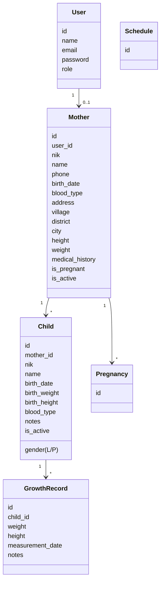

# Posyandu Vinca

Aplikasi web pencatatan dan pemantauan kesehatan ibu & balita di Posyandu, dibangun dengan **Laravel 12**, **Tailwind CSS**, **Alpine.js**, dan **Chart.js**. Aplikasi ini mendukung tiga peran pengguna (Admin, Kader, dan Ibu) dengan hak akses dan dashboard yang berbeda.

## Daftar Isi

- [Fitur](#fitur)
- [Stack Teknologi](#stack-teknologi)
- [Struktur Direktori](#struktur-direktori)
- [Skema Database](#skema-database)
- [Peran Pengguna & Hak Akses](#peran-pengguna--hak-akses)
- [Daftar Route](#daftar-route)
- [Persyaratan](#persyaratan)
- [Instalasi](#instalasi)
- [Menjalankan Aplikasi (Development)](#menjalankan-aplikasi-development)
- [Membuat User per Role](#membuat-user-per-role)
- [Pengujian](#pengujian)
- [Catatan & TODO](#catatan--todo)
- [Lisensi](#lisensi)

## Fitur

- **Autentikasi & Manajemen User** (Laravel Breeze): register, login, logout, lupa/reset password, verifikasi email, ubah password, hapus akun.
- **Role Based Access Control** via middleware `role` (`admin`, `kader`, `ibu`).
- **Dashboard per role**:
  - Admin: statistik total anak/ibu/pemeriksaan + grafik berat badan.
  - Kader: statistik total anak & total pemeriksaan.
  - Ibu: profil ibu & daftar anak miliknya.
- **Manajemen Data Ibu (Mothers)** – CRUD oleh Admin (NIK, nama, kontak, alamat, data kesehatan, status hamil/aktif).
- **Manajemen Data Anak (Children)** – CRUD oleh Admin & Kader, terhubung ke Ibu (1‑to‑many).
- **Catatan Pertumbuhan (Growth Records)** – CRUD oleh Admin & Kader (berat, tinggi, tanggal pengukuran, catatan).
- **Grafik Pertumbuhan** – visualisasi berat & tinggi balita lintas waktu menggunakan Chart.js.
- **Profil Admin** – edit profil, ubah password, hapus akun.

## Stack Teknologi

| Lapisan | Teknologi |
|---|---|
| Bahasa | PHP ^8.2 |
| Framework | Laravel ^12.0 |
| Auth scaffolding | Laravel Breeze ^2.4 (Blade) |
| Frontend tooling | Vite ^7, Laravel Vite Plugin ^2 |
| CSS | Tailwind CSS ^3.1, @tailwindcss/forms |
| JS | Alpine.js ^3, Axios ^1, Chart.js (via CDN/asset) |
| Database default | SQLite (dapat diganti MySQL/PostgreSQL) |
| Testing | PHPUnit ^11.5 |
| Tooling dev | Laravel Pail, Laravel Pint, Laravel Sail, Mockery, Faker |

## Struktur Direktori

Bagian penting yang spesifik untuk Posyandu Vinca:

```
app/
├── Http/
│   ├── Controllers/
│   │   ├── Auth/                       # Breeze auth controllers
│   │   ├── ChartController.php         # Halaman grafik berat & tinggi
│   │   ├── ChildController.php         # CRUD anak
│   │   ├── DashboardController.php     # Dashboard Admin
│   │   ├── GrowthRecordController.php  # CRUD catatan pertumbuhan
│   │   ├── IbuDashboardController.php  # Dashboard Ibu
│   │   ├── KaderDashboardController.php# Dashboard Kader
│   │   ├── MotherController.php        # CRUD ibu
│   │   ├── ProfileController.php       # Profil user
│   │   └── RoleRedirectController.php  # Redirect /dashboard sesuai role
│   └── Middleware/
│       └── RoleMiddleware.php          # alias 'role' di bootstrap/app.php
└── Models/
    ├── Child.php
    ├── GrowthRecord.php
    ├── Mother.php
    ├── Pregnancy.php          # skeleton (belum diimplementasikan)
    ├── Schedule.php           # skeleton (belum diimplementasikan)
    └── User.php
database/
├── migrations/                # users + role, mothers, children, growth_records, pregnancies, schedules
└── seeders/DatabaseSeeder.php
resources/views/
├── auth/                      # Breeze auth views
├── charts/index.blade.php     # Grafik pertumbuhan (Chart.js)
├── children/                  # index, create, edit
├── components/                # komponen Blade Breeze
├── growth-records/            # index, create, edit
├── kader/dashboard.blade.php
├── layouts/                   # app, guest, navigation
├── mothers/                   # index, create, edit, show, dashboard (ibu)
├── profile/                   # edit + partials
├── dashboard.blade.php        # Dashboard Admin
└── welcome.blade.php
routes/
├── auth.php                   # routes Breeze
└── web.php                    # routes aplikasi
```

## Skema Database



Detail field merujuk ke migration di `database/migrations/`. Catatan: tabel `pregnancies` & `schedules` saat ini masih skeleton (hanya `id` + `timestamps`).

## Peran Pengguna & Hak Akses

| Fitur / Halaman | Admin | Kader | Ibu |
|---|:---:|:---:|:---:|
| `/dashboard` (auto‑redirect) | ✅ | ✅ | ✅ |
| `/admin/dashboard` | ✅ | ❌ | ❌ |
| `/kader/dashboard` | ❌ | ✅ | ❌ |
| `/ibu/dashboard` (lihat catatan TODO) | ❌ | ❌ | ✅ |
| CRUD `mothers` | ✅ | ❌ | ❌ |
| CRUD `children` | ✅ | ✅ | ❌ |
| CRUD `growth-records` | ✅ | ✅ | ❌ |
| `charts` (grafik pertumbuhan) | ✅ | ✅ | ❌ |
| `profile` (edit/update/destroy) | ✅ | ❌ | ❌ |

Pembatasan akses dijalankan oleh `App\Http\Middleware\RoleMiddleware` (didaftarkan sebagai alias `role` di `bootstrap/app.php`). Contoh penggunaan:

```php
Route::middleware(['auth', 'role:admin,kader'])->group(function () { ... });
```

## Daftar Route

Route utama (lihat `routes/web.php` & `routes/auth.php`):

| Method | URI | Nama | Middleware |
|---|---|---|---|
| GET | `/` | – | – (redirect ke `/dashboard`) |
| GET | `/dashboard` | `dashboard` | `auth` |
| GET | `/admin/dashboard` | `admin.dashboard` | `auth`, `role:admin` |
| GET | `/kader/dashboard` | `kader.dashboard` | `auth`, `role:kader` |
| RES | `/mothers` | `mothers.*` | `auth`, `role:admin` |
| RES | `/children` | `children.*` | `auth`, `role:admin,kader` |
| RES | `/growth-records` | `growth-records.*` | `auth`, `role:admin,kader` |
| GET | `/charts` | `charts` | `auth`, `role:admin,kader` |
| GET/PATCH/DELETE | `/profile` | `profile.edit/update/destroy` | `auth`, `role:admin` |
| – | Routes Breeze (`login`, `register`, dll.) | – | dari `routes/auth.php` |

## Persyaratan

- PHP **>= 8.2** dengan ekstensi standar Laravel (mbstring, openssl, pdo, tokenizer, xml, ctype, json, bcmath, fileinfo, dll).
- Composer 2.x
- Node.js **>= 20** + npm (atau pnpm/yarn) untuk Vite & Tailwind.
- Database: **SQLite** (default) atau MySQL/MariaDB/PostgreSQL.
- Opsional: XAMPP / Laragon / Herd jika menjalankan di Windows.

## Instalasi

```bash
# 1. Clone repository
git clone <url-repo> posyandu-vinca
cd posyandu-vinca

# 2. Install dependency PHP
composer install

# 3. Install dependency frontend
npm install

# 4. Salin & generate key
cp .env.example .env       # Windows: copy .env.example .env
php artisan key:generate

# 5. (Opsional) Buat file database SQLite jika DB_CONNECTION=sqlite
#    Pastikan baris DB_DATABASE di .env mengarah ke path absolut file .sqlite
#    contoh: DB_DATABASE=C:/xampp/htdocs/posyandu-vinca/database/database.sqlite
# Linux/Mac:
touch database/database.sqlite
# Windows PowerShell:
# New-Item database/database.sqlite -ItemType File

# 6. Jalankan migrasi (dan seeder jika perlu)
php artisan migrate
# php artisan db:seed
```

> Repository ini juga menyediakan script praktis: `composer setup` yang menjalankan rangkaian instalasi (`composer install`, copy `.env`, `key:generate`, `migrate --force`, `npm install`, `npm run build`).

### Konfigurasi Database (alternatif MySQL)

Edit `.env`:

```env
DB_CONNECTION=mysql
DB_HOST=127.0.0.1
DB_PORT=3306
DB_DATABASE=posyandu_vinca
DB_USERNAME=root
DB_PASSWORD=
```

Lalu jalankan `php artisan migrate`.

## Menjalankan Aplikasi (Development)

Cara cepat (semua sekaligus – server, queue, log, dan Vite):

```bash
composer dev
```

Atau manual di terminal terpisah:

```bash
php artisan serve          # http://127.0.0.1:8000
npm run dev                # Vite dev server (HMR untuk Tailwind/JS)
php artisan queue:listen   # opsional, jika menggunakan queue
php artisan pail           # opsional, log realtime
```

Build aset produksi:

```bash
npm run build
```

## Membuat User per Role

Saat ini `register` Breeze membuat user baru **tanpa memilih role**, dan default kolom `role` di migration adalah `admin`. Untuk membuat akun dengan role tertentu, gunakan Tinker:

```bash
php artisan tinker
```

```php
\App\Models\User::create([
    'name' => 'Kader Posyandu',
    'email' => 'kader@example.com',
    'password' => bcrypt('password'),
    'role' => 'kader',           // 'admin' | 'kader' | 'ibu'
]);
```

Untuk role `ibu`, agar Dashboard Ibu menampilkan data, tambahkan baris pada tabel `mothers` dengan `user_id` mengarah ke user tersebut.

## Pengujian

Suite test menggunakan PHPUnit (test bawaan Breeze):

```bash
# via composer (membersihkan config dulu)
composer test

# atau langsung
php artisan test
```

Test yang tersedia di `tests/Feature/` mencakup autentikasi, registrasi, reset password, verifikasi email, konfirmasi password, update password, dan profil.

## Catatan & TODO

Beberapa hal yang ditemukan dari studi kode dan layak untuk diperbaiki/dilengkapi:

- **Route `/ibu/dashboard` belum terdaftar** di `routes/web.php`, padahal `RoleRedirectController` mengarahkan user role `ibu` ke sana. Perlu ditambahkan route untuk `IbuDashboardController@index` di grup `auth, role:ibu`.
- **View Ibu Dashboard**: `IbuDashboardController` mengembalikan `view('ibu.dashboard')`, tetapi file yang ada saat ini berlokasi di `resources/views/mothers/dashboard.blade.php`. Pindahkan ke `resources/views/ibu/dashboard.blade.php` atau ubah pemanggilan view-nya.
- **Nama file migration**: `database/migrations/2026_05_11_085352_create_mothers_table.php.php` memiliki dua kali ekstensi `.php`. Disarankan rename menjadi `..._create_mothers_table.php`.
- **`ChildController@show`** memanggil `view('children.show')` yang belum ada — perlu dibuat atau hapus method `show`.
- **Default role**: migration `add_role_to_users_table` men‑set default `admin`. Untuk produksi sebaiknya default `ibu` (atau dipaksa lewat form register) agar tidak setiap user baru otomatis menjadi admin.
- **Model `Pregnancy` & `Schedule`** masih kosong, demikian pula tabelnya — fitur kehamilan dan jadwal posyandu belum diimplementasikan.
- **Relasi `User → Mother`** dipakai di `IbuDashboardController` (`$user->mother`) tetapi belum didefinisikan di `App\Models\User`. Tambahkan relasi `hasOne(Mother::class)` di model User.
- **Validasi MotherController** masih minimal (hanya `name`, `nik`, `phone`) sementara form/migration menyediakan banyak field tambahan (alamat, data kesehatan, dsb). Bisa diperluas.
- **Chart.js**: pastikan library Chart.js dimuat (via CDN di layout atau sebagai dependency npm) karena view `dashboard` & `charts/index` memakai `new Chart(...)`.

## Lisensi

Aplikasi dibangun di atas framework [Laravel](https://laravel.com) yang berlisensi [MIT](https://opensource.org/licenses/MIT). Penggunaan kode aplikasi ini mengikuti lisensi yang ditetapkan oleh pemilik repository.
